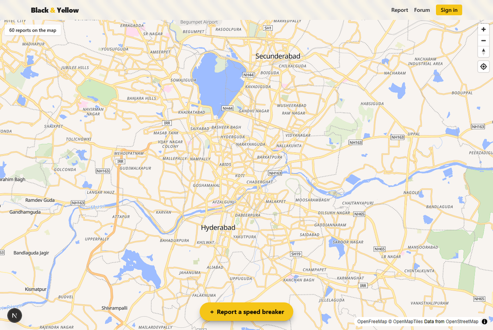
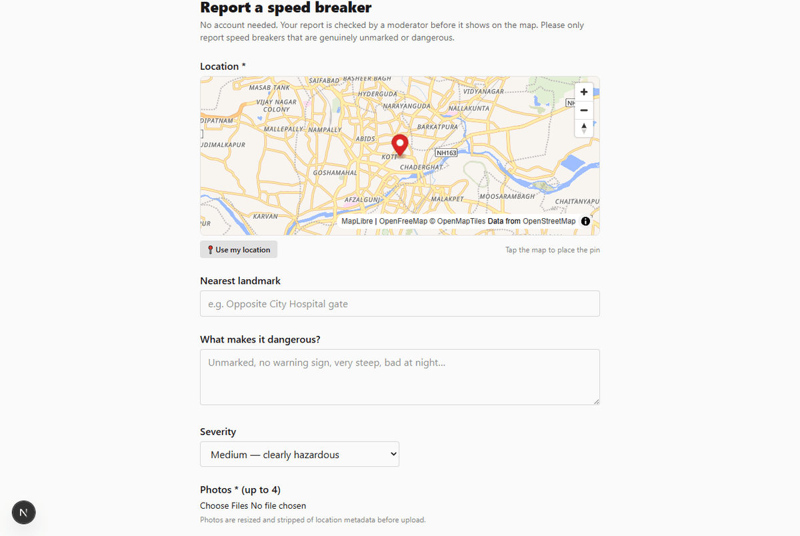
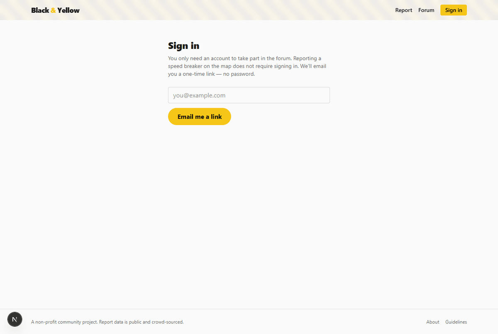
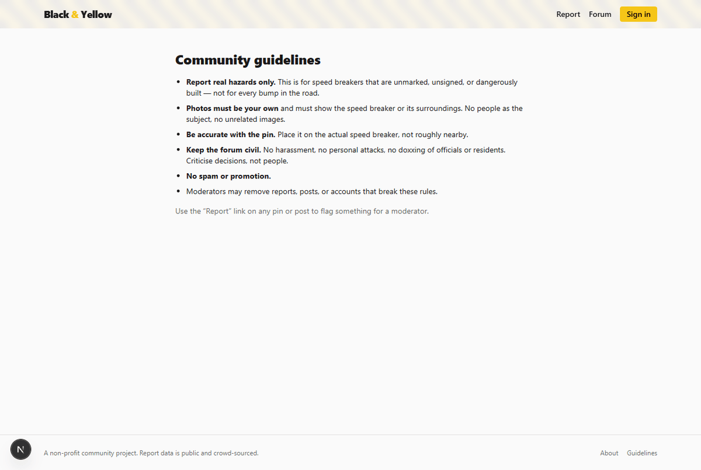

# Black & Yellow


A community map of dangerous, unmarked speed breakers, with a discussion forum
and a moderator workflow. Built to run on **$0/year** hosting.

- **Map** — anyone can drop a pin + photos (no account). Submissions go to a
  moderation queue and only appear once approved.
- **Forum** — a global board (Announcements / Successes / General) plus an
  auto-created discussion thread per approved pin. Posting needs a (passwordless)
  account.
- **Moderation** — `/admin` for moderators: approve/reject reports, confirm
  "painted" photos, handle flags, remove posts. Admins can also manage roles.

## Screenshots

| Public map | Report a speed breaker |
|---|---|
| [](docs/screenshots/map.png) | [](docs/screenshots/submit.png) |
| **Passwordless sign-in** | **Community guidelines** |
| [](docs/screenshots/login.png) | [](docs/screenshots/guidelines.png) |

On the live map each report is a coloured dot (orange/red by severity, green once
painted) and nearby reports cluster together; the screenshot above was taken
against an empty database.

## Stack

| Concern | Choice |
|---|---|
| Framework | Next.js (App Router) + TypeScript + Tailwind v4 |
| Hosting | Vercel Hobby (free) |
| DB / Auth / Storage | Supabase free tier (Postgres + PostGIS) |
| Map | MapLibre GL + OpenFreeMap vector tiles (no key) |
| Captcha | hCaptcha (free) |
| Keep-alive | GitHub Actions cron → `/api/health` |

## Local setup

1. **Create a Supabase project** (free tier).
2. In the Supabase **SQL editor**, run the three files in `supabase/migrations/`
   in order: `0001_init.sql`, `0002_rls.sql`, `0003_storage_seed.sql`.
   (Or use the CLI: `supabase link` then `supabase db push`.)
3. Copy env vars:
   ```bash
   cp .env.example .env.local
   ```
   Fill in from Supabase → Project Settings → API:
   - `NEXT_PUBLIC_SUPABASE_URL`, `NEXT_PUBLIC_SUPABASE_ANON_KEY`
   - `SUPABASE_SERVICE_ROLE_KEY` (server only)
   Set `NEXT_PUBLIC_MAP_CENTER_LAT/LNG/ZOOM` to your launch city.
   hCaptcha vars can stay as the provided test keys locally (captcha is skipped
   when `HCAPTCHA_SECRET` is the all-zero test value).
4. Install & run:
   ```bash
   npm install
   npm run dev
   ```
5. _(optional)_ Load sample data for testing — 8 Hyderabad speed breakers
   (2 already "painted") plus a few forum posts: run
   `supabase/seed_sample.sql` in the SQL editor. It's re-runnable and tagged
   `submitter_token = 'sample-seed'` for easy cleanup.

## Auth configuration (Supabase dashboard)

- **Authentication → URL Configuration**: set Site URL to your deployed URL and
  add `http://localhost:3000/**` + `https://<your-app>.vercel.app/**` to the
  redirect allow-list.
- **Authentication → Email**: the default magic-link template works. For more
  than a few sign-ins per hour, add a free SMTP provider (e.g. Brevo, 300/day)
  under **Project Settings → Auth → SMTP**.

## Make yourself an admin

After signing in once, run this in the Supabase SQL editor:

```sql
update profiles set role = 'admin'
where id = (select id from auth.users where email = 'you@example.com');
```

## Deploy (Vercel)

[](https://vercel.com/new/clone?repository-url=https://github.com/yash-seth/The-Black-and-Yellow-Initiative)

**Full step-by-step: [`DEPLOY.md`](DEPLOY.md).** In short:

1. Create a free Supabase project; run `supabase/all_migrations.sql` in the SQL
   editor (optionally `supabase/seed_sample.sql` too).
2. Import this repo into Vercel; add the env vars (Supabase keys, the Hyderabad
   map center, `NEXT_PUBLIC_SITE_URL`, a random `HEALTH_PING_SECRET`).
3. Point Supabase Auth Site URL / redirect list at the Vercel URL.
4. Add the `HEALTH_URL` GitHub repo secret for the keep-alive workflow.

### Keep the database awake

Supabase free projects pause after ~7 days idle. Add a GitHub **repo secret**
`HEALTH_URL` = `https://<your-app>.vercel.app/api/health?secret=<HEALTH_PING_SECRET>`.
The workflow in `.github/workflows/keepalive.yml` pings it every 3 days.

## Free-tier limits to watch

- Supabase: 500 MB DB, 1 GB storage (~3000 compressed photos), 2 GB egress/mo.
- Photos are compressed client-side to ~0.3 MB and stripped of EXIF/GPS.
- OpenFreeMap has no SLA; to switch to MapTiler set `NEXT_PUBLIC_MAP_STYLE_URL`
  to a MapTiler style URL with your key.

## Project layout

```
app/                Next.js routes (map, submit, pin/[id], forum, admin, api)
components/          Client components (MapView, PinForm, ThreadView, …)
lib/                 Supabase clients, auth, captcha, rate limit, config
supabase/migrations/ SQL: schema, RLS, storage + seed
.github/workflows/   keep-alive cron
```
